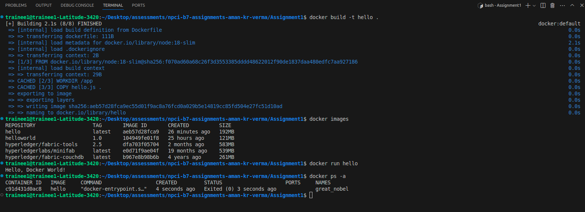
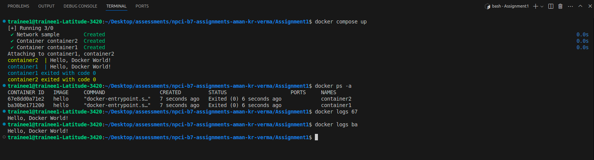

# Docker Node.js Hello Docker World

In this project, we are creating a js file to print a hello statement, and building and running a docker image for it.

## Steps to Build and Run the Docker Image

### 1. Create the Files

First, need to create the following files in the working directory:
- `Dockerfile`
- `hello.js`
- `README.md`

### 2. Build the Docker Image

To build the Docker image, need to run the following command in terminal:

```bash
docker build -t hello .
```
*(This will create a Docker image with the tag hello based on the Dockerfile.)*

### 3. List the Docker Images
To get a list of all the docker images available in local, need to run the following command:

```bash
docker images
```
*(This will show the hello image in the list)*.

### 4. Run the Docker Container
To run the container, need to run the following command:

```bash
docker run hello
```
*(This will start the container and execute the hello.js file using Node.js, with below output:)*

```bash
Hello, Docker World!
```

### 5. List of Containers
To list all the containers (running and not running both), we can use the following command:

```bash
docker ps -a
```

sample output:
| REPOSITORY  | TAG    | IMAGE ID        | CREATED        | SIZE   |
|-------------|--------|-----------------|----------------|--------|
| hello       | latest | aeb57d28fca9    | 13 seconds ago | 192MB  |

## Screenshot of the output



### Docker Compose 
To create 2 containers for the same image and run them independently, we need to create a docker-compose.yaml file, and mention the required configuration.
Once done, we can up the docker compose by using the following command:

```bash
docker compose up 
```

this will create two different images as required for the same image, and we can check the logs of each container independently.<br>
Sample output: 


