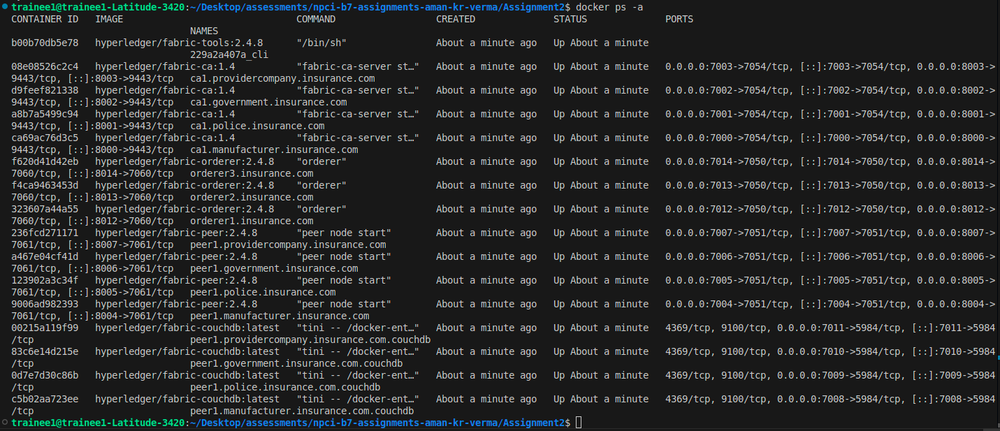

# Steps to run the minifab network

*Execute the following commands from Minifab_Network folder, where the spec.yaml file is available.*

## 1. up the network
```
minifab netup -s couchdb -e true -i 2.4.8 -o manufacturer.insurance.com
```

## 2. create channel
```
minifab create -c autochannel
```

## 3. join peers to the channel
```
minifab join -c autochannel
```

## 4. set an anchor peer
```
minifab anchorupdate
```

## 5. generate profile
```
minifab profilegen
```

# Using script

```
chmod +x startNetwork.sh
```
```
./startNetwork.sh
```

### sample output
