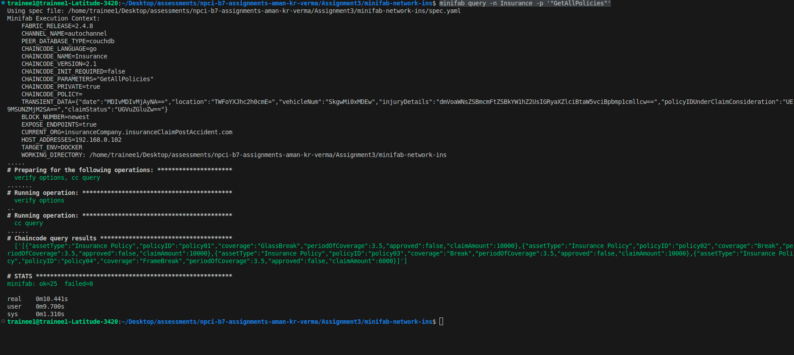

# Steps to run the minifab network

*Execute the following commands from Minifab_Network folder, where the spec.yaml file is available.*

## 1. up the network
```
minifab netup -s couchdb -e true -i 2.4.8 -o police.insuranceClaimPostAccident.com
```

## 2. create channel
```
minifab create -c autochannel
```

## 3. join peers to the channel
```
minifab join -c autochannel
```

## 4. set an anchor peer
```
minifab anchorupdate
```

## 5. generate profile
```
minifab profilegen
```

# Using script

```
chmod +x startNetwork.sh
```
```
./startNetwork.sh
```

### sample output


# Steps to run the deploy chaincode

*Execute the following commands from minifab_network-ins folder, where the spec.yaml file is available.*

```
sudo chmod -R 777 vars/
```
```
mkdir -p vars/chaincode/Insurance/go
```
```
cp -r ../chaincode/* vars/chaincode/Insurance/go/
```
```
cp vars/chaincode/Insurance/go/collection-config.json ./vars/Insurance_collection_config.json
```
```
minifab ccup -n Insurance -l go -v 1.5 -d false -r true
```

# steps to execute the transactions

## Create an accident record
```
minifab invoke -n Insurance -p '"AccidentRecordContract:CreateAccidentRecord","accidentRecord01"' -t '{"date":"'$DATE'","location":"'$LOCATION'","vehicleNum":"'$VEHICLENUM'","injuryDetails":"'$INJURYdETAILS'","policyIDUnderClaimConsideration":"'$POLICYIDUNDERCLAIMCONSIDERATION'","claimStatus":"'$CLAIMSTATUS'"}' -o police.insuranceClaimPostAccident.com
```

sample output


## query accident record

```
minifab query -n Insurance -p '"AccidentRecordContract:ReadAccidentRecord","accidentRecord01"'
```

sample output


## delete accident record

```
minifab invoke -n Insurance -p '"AccidentRecordContract:DeleteAccidentRecord","accidentRecord01"'
```

sample output


## create policy 

```
minifab invoke -n Insurance -p '"CreatePolicy","policy04","FrameBreak","3.5","6000.00"' -o insuranceCompany.insuranceClaimPostAccident.com
```

sample output


## approve policy

```
minifab invoke -n Insurance -p '"ApprovePolicy","policy04"' -o government.insuranceClaimPostAccident.com
```

sample output


## read policy
```
minifab invoke -n Insurance -p '"ReadPolicy","policy04"
' -o government.insuranceClaimPostAccident.com
```

sample output


# Rich queries

## 1. GetAllPolicies
```
minifab query -n Insurance -p '"GetAllPolicies"'
```

sample output



## 2. GetPolicyHistory
```
minifab query -n Insurance -p '"GetPolicyHistory","policy04"'
```

sample output


## 3. GetPoliciesWithPagination
```
minifab query -n Insurance -p '"GetPoliciesWithPagination","3",""'
```

sample output
