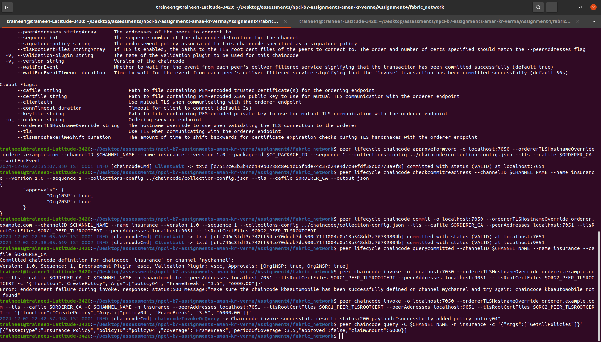
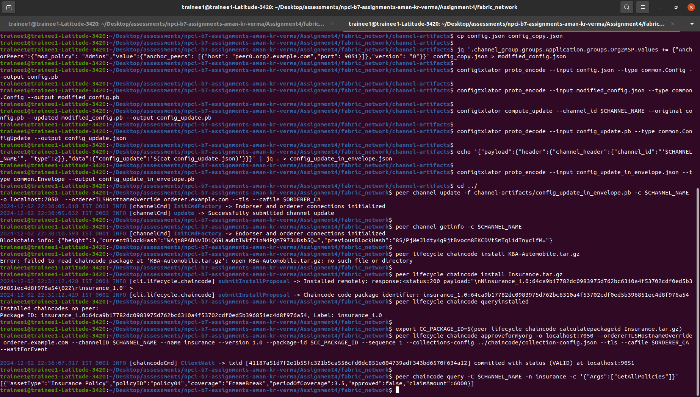

# steps to install chaincode on the network
```
peer lifecycle chaincode package Insurance.tar.gz --path ../chaincode/ --lang golang --label insurance_1.0
```
```
peer lifecycle chaincode install Insurance.tar.gz
```
```
export CC_PACKAGE_ID=$(peer lifecycle chaincode calculatepackageid Insurance.tar.gz)
```
```
peer lifecycle chaincode approveformyorg -o localhost:7050 --ordererTLSHostnameOverride orderer.example.com --channelID $CHANNEL_NAME --name insurance --version 1.0 --package-id $CC_PACKAGE_ID --sequence 1 --collections-config ../chaincode/collection-config.json --tls --cafile $ORDERER_CA --waitForEvent
```

```
peer lifecycle chaincode checkcommitreadiness --channelID $CHANNEL_NAME --name insurance --version 1.0 --sequence 1 --collections-config ../chaincode/collection-config.json --tls --cafile $ORDERER_CA --output json
```
```
peer lifecycle chaincode commit -o localhost:7050 --ordererTLSHostnameOverride orderer.example.com --channelID $CHANNEL_NAME --name insurance --version 1.0 --sequence 1 --collections-config ../chaincode/collection-config.json --tls --cafile $ORDERER_CA --peerAddresses localhost:7051 --tlsRootCertFiles $ORG1_PEER_TLSROOTCERT --peerAddresses localhost:9051 --tlsRootCertFiles $ORG2_PEER_TLSROOTCERT
```
```
peer lifecycle chaincode querycommitted --channelID $CHANNEL_NAME --name insurance --cafile $ORDERER_CA
```
```
peer chaincode invoke -o localhost:7050 --ordererTLSHostnameOverride orderer.example.com --tls --cafile $ORDERER_CA -C $CHANNEL_NAME -n insurance --peerAddresses localhost:7051 --tlsRootCertFiles $ORG1_PEER_TLSROOTCERT --peerAddresses localhost:9051 --tlsRootCertFiles $ORG2_PEER_TLSROOTCERT -c '{"function":"CreatePolicy","Args":["policy04", "FrameBreak", "3.5", "6000.00"]}'
```


## sample output




